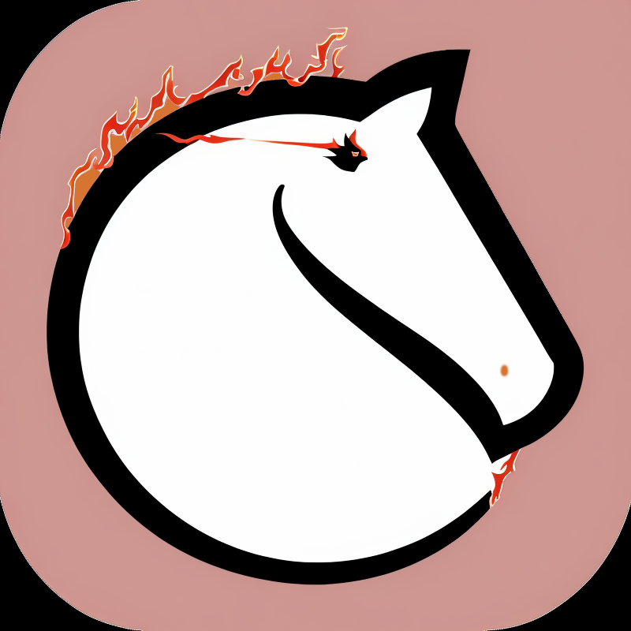

# ChessBot_Zoe
High Performing - Lichess Bot powered by Stockfish 17 that can vary thinking time based on opponent Elo and position evaluation.

<table>
  <tr>
    <td>
      
    </td>
    <td>
      <h1>Main Features</h1>
      <ul>
        <li>Stockfish 17 with various thinking time based on opponent Elo and position</li>
        <li>Personalized Opening Repertories to let the Bot follow your preferite lines (work in progress)</li>
        <li>Bot can play multiple games and you can configure bullet too (as of now it's more into blitz or longer)</li>
        <li>You can configure Stockfish thinking time or implement other chess logics</li>
        <li>Ollama model to chat, interact and even teach user in the game (added soon!)</li>
      </ul>
    </td>
  </tr>
</table>

## Info
This Chess Bot will have different styles. 

### Stockfish 17 with various thinking time
Vary its reasoning time based on opponent elo and how good or bad its position is.
Stockfish can respond in less than 1 second with a pretty good move, but the more time allowed the deeper the analysis.

Before moving, Stockfish will also analyze the position to determine how much more time it needs to spend (aka, the worse its position the more time it will use).

### Personalized Opening Repertories

Bot can follow certain lines of your choose (if you program them) in order to use Stockfish only later in the game.
This can sharp its playing speed (even if Stockfish can answer in less than 1 second too).

Please note that most of the "waiting time" is due to avoid too many Lichess API calls (for now it's 30/40 seconds between moves)

### Play any time

Bot can play every time, but for now only blitz or longer are accepted.

### Ollama Model to Chat, Interact and Teach Users (work in progress!)

The Bot will be powered by Ollama models (maybe Gemma2b) to chat with the user, analyzing position and giving hints.
Nope, even if it wants to teach you, it wants to win at all costs too!

#### Performances
Here are the performances (aka time to execute that part of code):
Stockfish is the time used by Stockfish to answer, Wait time is the time wait to prevent too many Lichess API calls.
These can be configured in the code.

Performances are done searching a starting position with my pc: Intel(R) Core(TM) i7-10750H CPU @ 2.60GHz - 16 Gb Ram.

Please note that these times can become a lot more longer in a real game in a complicated (or rare) position when the bot is online.

<table>
  <tr>
    <th>Stockfish</th>
    <th>Wait time</th>
  </tr>
  <tr>
    <td>1 / 40 sec</td>
    <td>30 / 40 sec</td>
  </tr>
</table>

#### Current version

For now it uses Stockfish with different analysis times in base of the opponent Elo and position evaluation.
I'm working on adding some specific opening Repertories and Ollama for chat with the user (soon!)

Working to make it improve!

##### About this repo

Please note that most of the Python files in this repo aren't used. But i left them to track the progresses made and because certain code had potential.

##### Thanks
Feel free to comment, and share your suggestions! :)
